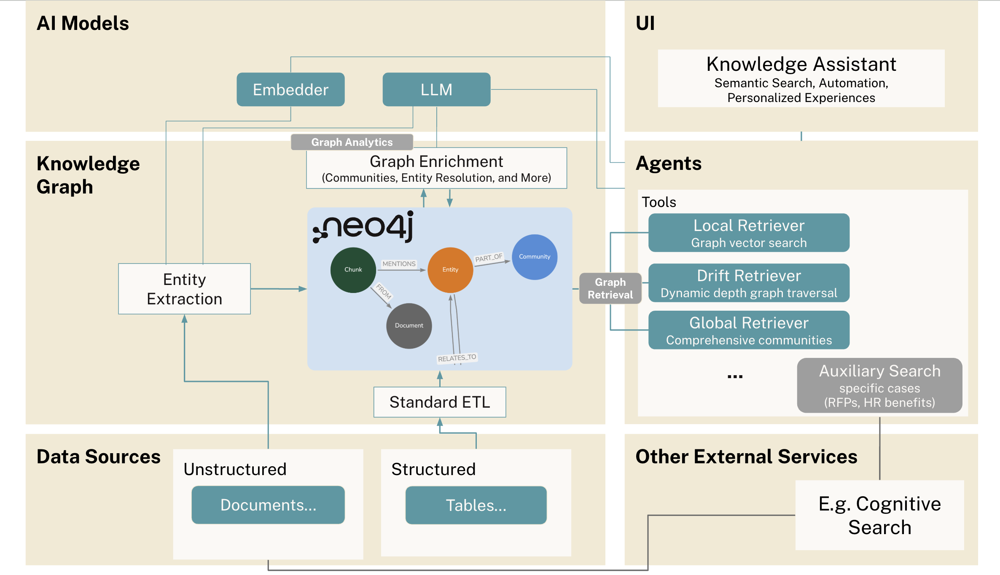

# Neo4j Employee Graph

__Link to this repo__
[github.com/neo4j-product-examples/neo4j-employee-graph](https://github.com/neo4j-product-examples/neo4j-employee-graph)

This hands-on workshop guides you through building an agentic GraphRAG application and demonstrates the importance of knowledge graphs and graph DBs for grounding AI, particularly in today's new Agentic world with advanced reasoning and diverse tool utilization.

You'll learn how to build a knowledge graph in Neo4j with a combination of unstructured and structured data sources. You will also learn how to build GraphRAG agents utilizing graph retrieval tools (including Neo4j MCP tools) and agents via Google ADK.

__Agentic GraphRAG Architecture__

## Use Case Example
__Employee Knowledge Assistant__

**Skills analysis, talent search, and team formation at Cyberdyne Systems**
- **Skills Analysis:** 
  - How many Python developers do I have?
  - Summarize talent and skills distributions
- **Person Similarities:** Who is most similar to Lucas Martinez?

- **Collaboration & teams:** Which individuals have collaborated to deliver the most AI Things?

You'll build an employee knowledge graph combining resume and HRIS information.

## Workshop Modules

### Module 1: Vector Search with Agents
Learn how to create document nodes with vector indexes in Neo4j and expose to vector search retrieval tools to support agents.

### Module 2: Graph Construction and Retrieval
Learn how to construct a simple starter knowledge graph from documents to help with agent retrieval tools and improve responses. You will learn how to think through creating a simple graph data model and see the process of entity extraction to populate the graph with the right data.
You will then leverage a Neo4j MCP server to expose natural language querying tools to improve responses as well as write your own Cypher expert tools.

### Module 3: Expanding Data Sources
Learn how you can easily expand to include new sources in a knowledge graph backed by a graph database.  We show how you can add structured data from a Human Resource Information System (HRIS) and connect it to people extracted from the previous unstructured resume docs from module 2.

You will then be able to access additional data to further improve responses and answer more questions.

### Module 4: (Optional) Configure MCP Toolbox Server
Use [MCP Toolbox](https://neo4j.com/blog/developer/ai-agents-gen-ai-toolbox/) to take all the expert tools from above and package in an MCP server for use by any MCP client.

